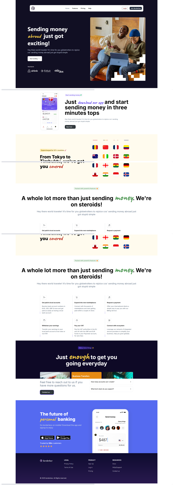
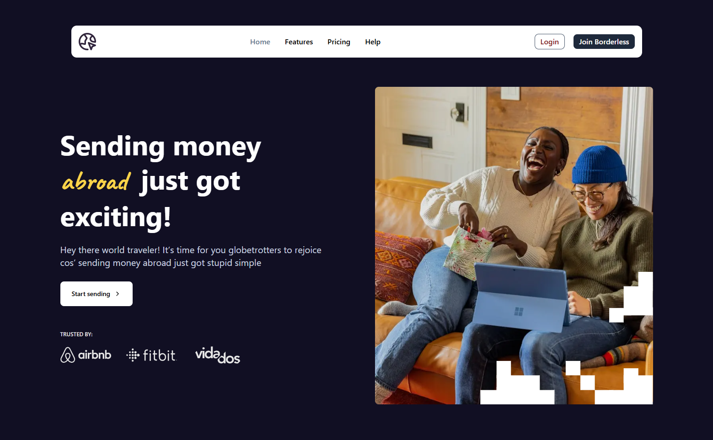

# Borderless Landing Page

Discover innovative financial solutions with our sleek and user-friendly fintech platform. Secure, efficient, and designed for growth.




---

## Table of Contents

- [Features](#features)
- [Technologies Used](#technologies-used)
- [Getting Started](#getting-started)
  - [Installation](#installation)
  - [Running the Project](#running-the-project)

---

## Features

- **Hero Section**
- **Animations**: Smooth and professional transitions powered by Framer Motion.
- **Responsive Design**: Fully optimized for all screen sizes (mobile, tablet, desktop).
- **Reusable Components**: Modular React components for maintainability.

---

## Technologies Used

- **React**: Building the user interface with reusable components.
- **Next**
- **Typescript**
- **Tailwind CSS**: Utility-first CSS for rapid and responsive design.
- **Framer Motion**: Seamless animations and transitions for better user experience.
- **JavaScript (ES6+)**: Interactive and dynamic logic.

---

## Getting Started

Follow the steps below to set up and run the project locally.

### Prerequisites

Ensure you have the following installed on your system:

- Node.js (v14 or higher)
- npm or yarn (package manager)

---

### Installation

1. Clone the repository:

   ```bash
   git clone https://github.com/Ehiremengold/borderless-landing-page.git

   ```

2. Navigate to the project directory:

   ```bash
   cd borderless-landing-page

   ```

3. Install dependencies:
   ```bash
   npm install
   # or
   yarn install
   ```

### Running the Project

1. Start the development server
   ```bash
   npm run dev
   _This will launch the application in development mode. Open your browser and go to http://localhost:3000._
